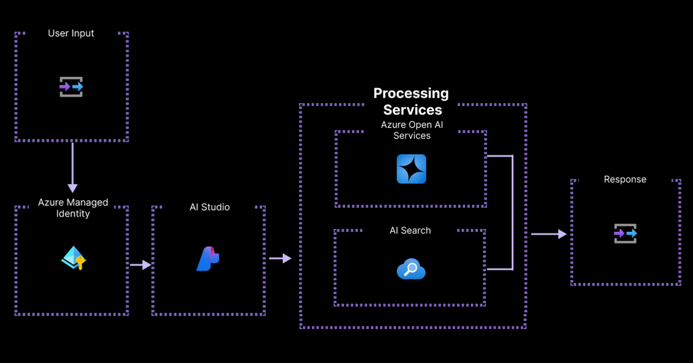

# RAG with Azure AI Studio and Promptflow

This repository has been initialized with the RAG with Azure AI Studio and Promptflow project template repository, which has been thoughtfully crafted with a template for Retrieval Augmented Generation using Promptflow. This template is designed to help you get started quickly and efficiently. The template project is a simplified version of the [Contoso Chat](https://github.com/Azure-Samples/contoso-chat/) sample project. 

## Architecture Overview

The following diagram provides an overview of the solution's architecture:

## Project Resources

To deliver the solution effectively, a set of Azure resources is necessary. The following table outlines the required resources and their specific purposes for the project.

| **Resource Name**       | **Purpose**                                                         |
|-------------------------|---------------------------------------------------------------------|
| **AI Hub**              | Centralized platform for managing AI solutions.                     |
| **AI Project**          | Organize and manage Gen AI projects.                                |
| **OpenAI Service**      | Access and use OpenAI models for various AI applications.           |
| **Application Insights**| Monitor application performance and detect issues.                  |
| **Log Analytics**       | Collect, analyze, and visualize logs from your resources.           |
| **Container Registry**  | Store and manage container images for orchestration deployments.    |
| **Key Vault**           | Manage and protect sensitive information such as keys and secrets.  |
| **Storage Account**     | Store and manage data and files used by your application.           |
| **AI Search**           | Implement Vector Search for the RAG retrieval step.                 |
| **App Service**         | Host and manage your app.                                           |
| **App Service Plan**    | Provide the resources that your App Service app needs to run.       |

> **Note:** The **Premium V3 SKU** is required for the Azure App Service Plan to ensure the necessary performance and scalability for the application.

The following deployments will be created in the Azure OpenAI Service:

| Deployment Name          | Model Name             | Model Version | SKU Name | Capacity |
|--------------------------|------------------------|---------------|----------|----------|
| gpt-35-turbo             | gpt-35-turbo           | 0613          | Standard | 20       |
| gpt-4                    | gpt-4o                 | 2024-05-13    | Standard | 20       |
| text-embedding-ada-002   | text-embedding-ada-002 | 2             | Standard | 20       |

To find out if you have a quota for the model in a specific region, refer to the [check your quota](docs/check_your_quota.md) documentation. For more details about the deployments, you can refer to the [ai.yaml](infra/ai.yaml) file. It is important to check if there is a quota for these models in the desired region.

## Infrastructure as Code

To facilitate the creation of resources, this repository includes Bicep templates (IaaC) to create the following project resources. More details can be found in the [main.bicep](infra/main.bicep) file.

## Contributing

This project welcomes contributions and suggestions.  Most contributions require you to agree to a
Contributor License Agreement (CLA) declaring that you have the right to, and actually do, grant us
the rights to use your contribution. For details, visit https://cla.opensource.microsoft.com.

When you submit a pull request, a CLA bot will automatically determine whether you need to provide
a CLA and decorate the PR appropriately (e.g., status check, comment). Simply follow the instructions
provided by the bot. You will only need to do this once across all repos using our CLA.

This project has adopted the [Microsoft Open Source Code of Conduct](https://opensource.microsoft.com/codeofconduct/).
For more information see the [Code of Conduct FAQ](https://opensource.microsoft.com/codeofconduct/faq/) or
contact [opencode@microsoft.com](mailto:opencode@microsoft.com) with any additional questions or comments.

## Trademarks

This project may contain trademarks or logos for projects, products, or services. Authorized use of Microsoft 
trademarks or logos is subject to and must follow 
[Microsoft's Trademark & Brand Guidelines](https://www.microsoft.com/en-us/legal/intellectualproperty/trademarks/usage/general).
Use of Microsoft trademarks or logos in modified versions of this project must not cause confusion or imply Microsoft sponsorship.
Any use of third-party trademarks or logos are subject to those third-party's policies.
