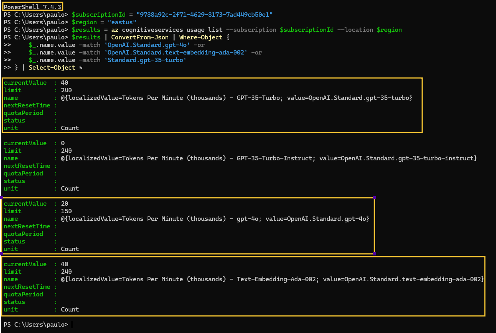

# Checking Azure OpenAI Quota

The table below shows the utilization for each environment created using the Bicep templates from this repository.

| Deployment Name          | Model Name             | Model Version | SKU Name | Capacity |
|--------------------------|------------------------|---------------|----------|----------|
| gpt-35-turbo             | gpt-35-turbo           | 0613          | Standard | 20       |
| gpt-4                    | gpt-4o                 | 2024-05-13    | Standard | 20       |
| text-embedding-ada-002   | text-embedding-ada-002 | 2             | Standard | 20       |

Use the commands below to check the availability and quota of Azure OpenAI models in a specific region. If the region you want to use does not have availability, you can choose another region. If you don't have enough quota, you can adjust your quota settings or request more quota. 

Remember, if you are using the same subscription for multiple environments, such as **dev**, **qa**, and **prod**, you will need to account for the combined quota. For example, instead of 20 TPMs of capacity as shown in the table, you would need 60 TPMs.

**Powershell 7+** - [Click here to download (Windows)](https://learn.microsoft.com/en-us/powershell/scripting/install/installing-powershell-on-windows?view=powershell-7.4#installing-the-msi-package)

```powershell
$subscriptionId = "replace by your subscription id" 
$region = "replace by the desired region" 
$results = az cognitiveservices usage list --subscription $subscriptionId --location $region 
$results | ConvertFrom-Json | Where-Object { 
    $_.name.value -match 'OpenAI.Standard.gpt-4o' -or 
    $_.name.value -match 'OpenAI.Standard.text-embedding-ada-002' -or 
    $_.name.value -match 'Standard.gpt-35-turbo' 
} | Select-Object *
```

**Bash**

```bash
subscriptionId="replace by your subscription id" 
region="replace by the desired region"
results=$(az cognitiveservices usage list --subscription $subscriptionId --location $region) 
echo $results | jq -r '.[] | select(.name.value | test("Standard.gpt-4"))'
echo $results | jq -r '.[] | select(.name.value | test("OpenAI.Standard.text-embedding-ada-002"))'
echo $results | jq -r '.[] | select(.name.value | test("Standard.gpt-35-turbo"))' 
```

Example of verification in EastUS with Powershell:

